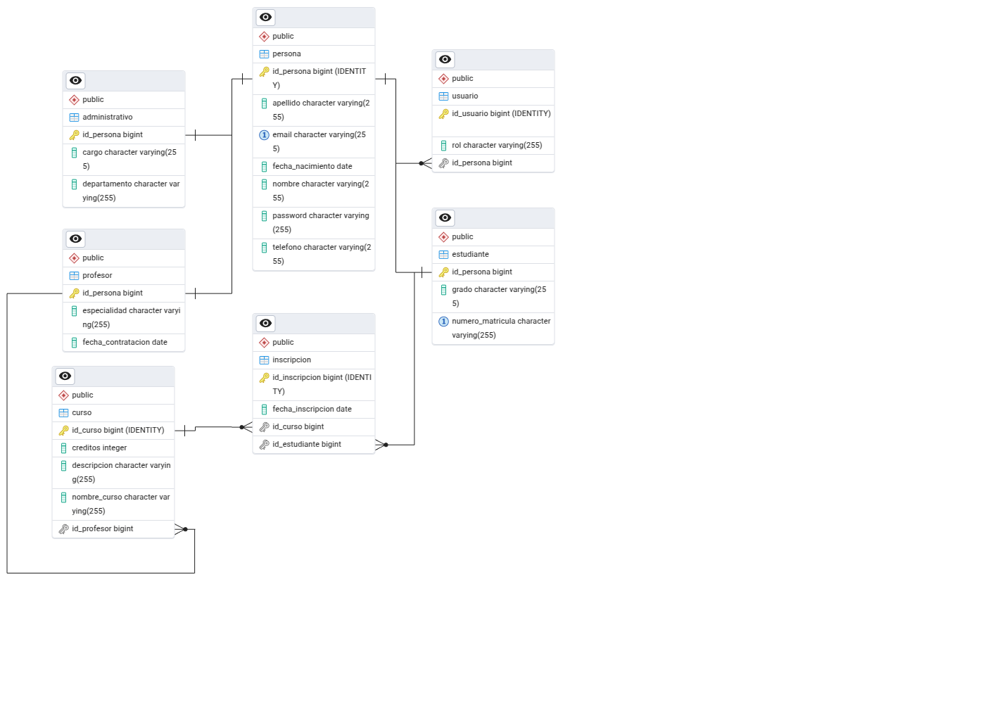

#  Sistema de Gestión Académica

Esta prueba técnica consiste en desarrollar un **sistema CRUD para el registro de personas en una escuela**, incluyendo estudiantes, profesores y personal administrativo. El sistema implementa **backend en Java con Spring Boot** y **frontend en Angular**, con un enfoque en buenas prácticas, validaciones, arquitectura en capas y modular.

Para entender el funcionamiento te recomiendo ver el manual de usuario:
[Manual del Usuario Click Aqui](manual-usuario/Manual-de-usuario-SGE-CODESA.pdf)

## 🚀 Tecnologías Utilizadas

### 🖥️ Frontend
- [Angular 17](https://angular.io/)
- TypeScript
- PrimeNG
- Diseño responsivo
- Formularios con validaciones
- Paginación y confirmación de eliminación

### 🛠️ Backend
- [Spring Boot](https://spring.io/projects/spring-boot)
- Java 17+
- Spring Data JPA (Desarrollo)
- Maven
- JWT
- ModelMapper (DTOs)
- H2 Database
- PostgreSQL (Final)
- Arquitectura en capas (Controladores, Servicios, Repositorios)
- Swagger OpenAPI
- Manejo de logs y excepciones

### Diagrama de relaciones

## Funcionalidades

### Backend
- CRUD completo para todas las entidades
- Validaciones de campos obligatorios, emails, teléfonos y fechas
- Validación de relaciones y unicidad
- Manejo de excepciones logs
- Paginación en listados
- Autenticación JWT
- Contador total de personas, estudiantes, profesores y administradores
- Validación de datos duplicados (evita que la misma persona se registre en varios roles o se duplique en la misma entidad)
- Validacion de EMAIL para datos duplicados
- Creado en base a arquitectura por capas, con etidades y dtos, servicios, controladores, repositorios y excepciones 

### Frontend
- Listados de entidades con paginación
- Formularios de creación y edición
- Validaciones en formularios
- Confirmación de eliminación
- Comunicación con backend a través de servicios HTTP
- Diseño responsivo y moderno con Angular Material o PrimeNG
- Barra de busqueda y paginacion en las tablas
- Visualización de graficos y estadisticas
- Manejo de token, rutas protegidas y sesion local
- Confirmacion de eliminación

---

### Instalación
1. Clonar el repositorio desde Git
   git clone https://github.com/Juanse2005/codesa.git

2. Abrir el proyecto en VS Code
   'cd backend' o 'cd frontend'

### ▶️ Iniciar el Backend (Springboot)
1. Sigue los pasos:
    1. Entrar al directorio del backend:
      'cd backend'

    2. Construir el proyecto con Maven:
       mvn clean install
    
    3. Ejecutar la aplicación:
      ./mvnw spring-boot:run // O iniciar proyecto
    
    4. Acceder a Swagger
       http://localhost:8080/swagger-ui.html
       
### ▶️ Iniciar Frontend (Angular)
1. sigue los pasos:
    1. Entrar al directorio del frontend:
       cd frontend
    
    2. Instalar dependencias:
       npm install
    
    3. Ejecutar la aplicación:
       ng serve --o  # Para abrir el frontend en una nueva pestaña
